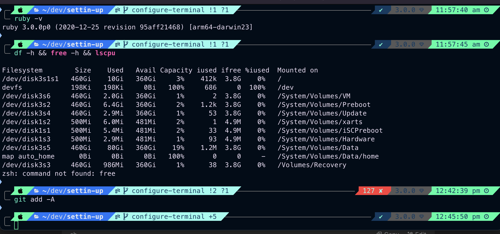
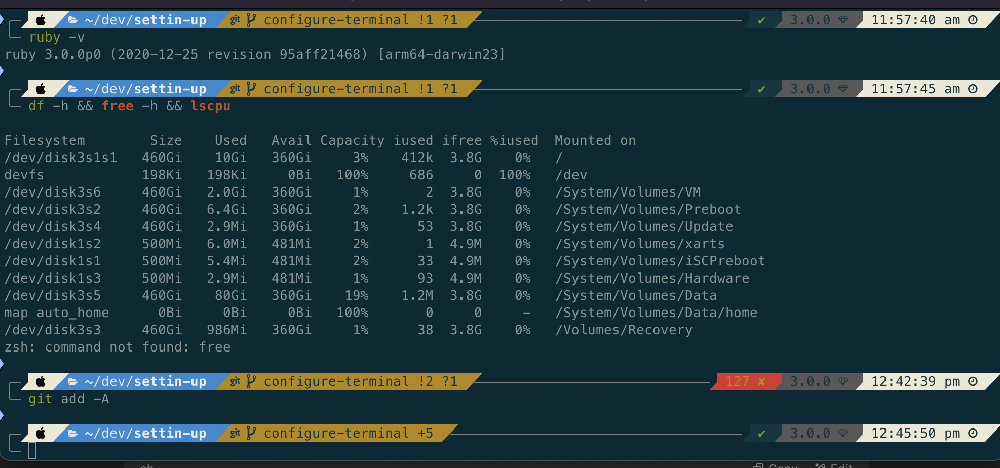

# settin-up

This repo is used to set up my Mac. Ideally this should be run in [iTerm2](https://iterm2.com/downloads.html)

I use either VS Code, or Vim for development. This repo configures both the way I like it. I primarily do development with:

- Ruby
- Python
- Javscript/Typescript
- Shell
- Go

The plugins, dotfiles, formulae, etc contained in this repo and meant to enhance your efficiency when developing using these languages.

## Easy as 1... 2... 3!

If you are not Devxiongmao (Jon Psaila), be sure to update the config/git_config.sh file with your git config information.

```sh
git clone https://github.com/devxiongmao/settin-up.git
cd settin-up
./system-setup.sh
```

## Once the script is run....

1. Open iTerm2. You should be greeted with the setup wizard from powerlevel10k
2. Follow the setup wizard to customize your terminal
3. If the setup wizard doesn't appear, run `p10k configure`

## Setting the Theme

I've included two terminal themes within this repo: `trafalgar` and `devxiongmao`. Screenshots are below. They can be set as follows

1. In the iTerm2 menu bar, go `Profiles` -> `Open Profiles` -> `Edit Profiles`
2. On the `Profiles` tab, select `Colors`, then at the bottom of the pane, open the select that is labelled `Color Presets`
3. Click `Import`, then navigate to this directory and import either the `trafalgar.itermcolors` or `devxiongmao.itermcolors` file depending on your preference
4. Once imported, open the `Color Presets` selector again, and you should see the theme present. Click it to select it.
5. Admire your handiwork and marvel at your beautiful terminal

## Install Chrome Extensions (Optional)

I enjoy a collection of chrome extensions that help me do web development and improve my overall web-surfin' experience!

1. [Bitwarden Password Manager](https://chromewebstore.google.com/detail/bitwarden-password-manage/nngceckbapebfimnlniiiahkandclblb?pli=1)
2. [React Developer Tools](https://chromewebstore.google.com/detail/react-developer-tools/fmkadmapgofadopljbjfkapdkoienihi?hl=en)
3. [Redux Dev Tools](https://chromewebstore.google.com/detail/redux-devtools/lmhkpmbekcpmknklioeibfkpmmfibljd?hl=en)
4. [Adblock](https://chromewebstore.google.com/detail/adblock-%E2%80%94-block-ads-acros/gighmmpiobklfepjocnamgkkbiglidom)
5. [Loom Video Recordings](https://chromewebstore.google.com/detail/loom-%E2%80%93-screen-recorder-sc/liecbddmkiiihnedobmlmillhodjkdmb)

## What's Included?

App/tool installs

- [bitwarden](https://bitwarden.com/)
- [discord](https://discord.com/)
- [docker](https://www.docker.com/)
- [iterm2](https://iterm2.com/downloads.html)
- [visual-studio-code](https://code.visualstudio.com/)
- [cursor](https://www.cursor.com/en)
- [libreoffice](https://www.libreoffice.org/)
- [caffeine](https://www.caffeine-app.net/)
- [maccy](https://maccy.app/)
- [Google Chrome](https://www.google.com/intl/en_ca/chrome/)
- [Redis](https://redis.io/)

Command Line Tools

- [Git configuration](config/git_config.sh)
- [The silver searcher](https://github.com/ggreer/the_silver_searcher), a lighting fast code searching tool similar to `ack`
- [tmux](https://thoughtbot.com/blog/a-tmux-crash-course) for session management
- [act](https://github.com/nektos/act) for running github actions locally 🚀
- [cspell](https://cspell.org/), a spell checker for code

Heavily Customized Terminal

- [Oh My ZSH](https://ohmyz.sh/)
- [powerlevel10k](https://github.com/romkatv/powerlevel10k) terminal theme
- Two color schemes

ZSH Plugins

- [Web Search](https://github.com/ohmyzsh/ohmyzsh/blob/master/plugins/web-search/README.md)
- [zsh-autosuggestions](https://github.com/zsh-users/zsh-autosuggestions)
- [zsh-syntax-highlighting](https://github.com/zsh-users/zsh-syntax-highlighting.git)
- [TheF\*ck](https://github.com/nvbn/thefuck) (Ridiculously crude name aside, exceptionally helpful plugin)

Aliases

- Sourcing
  - `zr` = "source ~/.zshrc"
- Unix
  - `la` = "ls -la"
  - `ln` = "ln -v"
- PS
  - `psa` = "ps aux"
  - `psag` = "ps aux | ag "
- git
  - `g` = "git"
  - `ga` = "git add"
  - `gs` = 'git status -s'
  - `gc` = "git commit -m"
  - `gaa` = "git add -A"
  - `gb` = 'git branch'
  - `gco` = "git checkout"
  - `gnb` = 'git checkout -b'
  - `gda` = "git branch | grep -v 'main' | xargs git branch -D"
  - `gbd` = "git branch -D"
  - `gr` = 'git rebase'
  - `gri` = 'git rebase -i'
  - `gra` = 'git rebase --abort'
  - `grc` = 'git rebase --continue'
  - `gd` = 'git diff'
  - `gl` = 'git log -10'
- docker
  - `di` = "docker image"
  - `dim` = "docker images"
  - `dcu` = "docker compose up"
  - `dcd` = "docker compose down"
  - `dl` = "docker logs -f"
  - `dv` = "docker volume"
  - `dpsa` = "docker ps -a"
  - `dda` = "docker rm $(docker ps -aq)"
  - `ddai` = "docker rmi $(docker images -aq)"
- Ruby/Rails
  - `c` = "rails console"
  - `s` = "rspec"
- Bundler
  - `b` = "bundle"
  - `be` = "bundle exec"
  - `bi` = "bundle install"
- Python
  - `pv` = "python3 --version"
  - `pc` = "python3"
  - `poa` = "poetry add"
- tmux
  - `tat` = 'tmux attach -t'
  - `tns` = 'tmux new -s'

## VS Code Extensions

### Productivity/Style/Language Agnostic Extensions

- **[PKief.material-icon-theme](https://marketplace.visualstudio.com/items?itemName=PKief.material-icon-theme)** – A popular icon theme for VS Code that provides Material Design-inspired icons for files and folders.
- **[MS-vsliveshare.vsliveshare](https://marketplace.visualstudio.com/items?itemName=MS-vsliveshare.vsliveshare)** - Enables real-time collaboration in VS Code, allowing developers to share their workspace and work on code together.
- **[github.vscode-pull-request-github](https://marketplace.visualstudio.com/items?itemName=github.vscode-pull-request-github)** – Integrates GitHub pull requests and issues directly into VS Code, enabling code review and issue management.
- **[github.vscode-github-actions](https://marketplace.visualstudio.com/items?itemName=github.vscode-github-actions)** – Provides tools to manage and monitor GitHub Actions workflows from within VS Code.
- **[vstirbu.vscode-mermaid-preview](https://marketplace.visualstudio.com/items?itemName=vstirbu.vscode-mermaid-preview)** – Provides tools to generate, visualize and manage mermaid diagrams within VS Code.
- **[ms-vscode.makefile-tools](https://marketplace.visualstudio.com/items?itemName=ms-vscode.makefile-tools)** – Provides convenient commands to build, debug, and run your targets as well as provides IntelliSense for Makefile projects.

### Ruby

- **[shopify.ruby-extensions-pack](https://marketplace.visualstudio.com/items?itemName=shopify.ruby-extensions-pack)** - A collection of VS Code extensions curated by Shopify to enhance the Ruby development experience.
- **[shopify.ruby-lsp](https://marketplace.visualstudio.com/items?itemName=shopify.ruby-lsp)** - A language server for Ruby, developed by Shopify, providing features like code completion, hover information, and diagnostics.
- **[sorbet.sorbet-vscode-extension](https://marketplace.visualstudio.com/items?itemName=sorbet.sorbet-vscode-extension)** - Integrates Sorbet, a static type checker for Ruby, into VS Code to provide type annotations and error detection.
- **[castwide.solargraph](https://marketplace.visualstudio.com/items?itemName=castwide.solargraph)** – Provides Ruby language server support, including code completion, linting, and inline documentation.
- **[kaiwood.endwise](https://marketplace.visualstudio.com/items?itemName=kaiwood.endwise)** – Automatically inserts `end` statements in Ruby when writing conditionals, loops, and method definitions.
- **[bung87.rails](https://marketplace.visualstudio.com/items?itemName=bung87.rails)** – Enhances Rails development in VS Code with navigation, model completion, and schema support.

### JavaScript

- **[dbaeumer.vscode-eslint](https://marketplace.visualstudio.com/items?itemName=dbaeumer.vscode-eslint)** – Integrates ESLint into VS Code for JavaScript and TypeScript linting and error detection.
- **[esbenp.prettier-vscode](https://marketplace.visualstudio.com/items?itemName=esbenp.prettier-vscode)** – Formats JavaScript, TypeScript, and other files using Prettier to enforce consistent code style.

### Python

- **[ms-python.python](https://marketplace.visualstudio.com/items?itemName=ms-python.python)** – Official Python extension providing IntelliSense, debugging, linting, and Jupyter Notebook support.
- **[njpwerner.autodocstring](https://marketplace.visualstudio.com/items?itemName=njpwerner.autodocstring)** – Generates Python docstrings automatically based on function signatures.
- **[tamasfe.even-better-toml](https://marketplace.visualstudio.com/items?itemName=tamasfe.even-better-toml)** – Adds advanced syntax highlighting and validation for TOML configuration files.
- **[ms-toolsai.jupyter](https://marketplace.visualstudio.com/items?itemName=ms-toolsai.jupyter)** – Enables Jupyter Notebook support, allowing interactive Python development within VS Code.
- **[KevinRose.vsc-python-indent](https://marketplace.visualstudio.com/items?itemName=KevinRose.vsc-python-indent)** – Fixes indentation issues in Python, particularly when working with VS Code’s auto-formatting.
- **[charliermarsh.ruff](https://marketplace.visualstudio.com/items?itemName=charliermarsh.ruff)** – Integrates Ruff, a fast Python linter, to catch errors and enforce coding standards.

### Go

- **[golang.go](https://marketplace.visualstudio.com/items?itemName=golang.go)** - Official Go extension for VS Code, providing IntelliSense, debugging, linting, and other Go development tools.

## Screenshots:

Theme 1: `trafalgar`


Theme 2: `devxiongmao`

